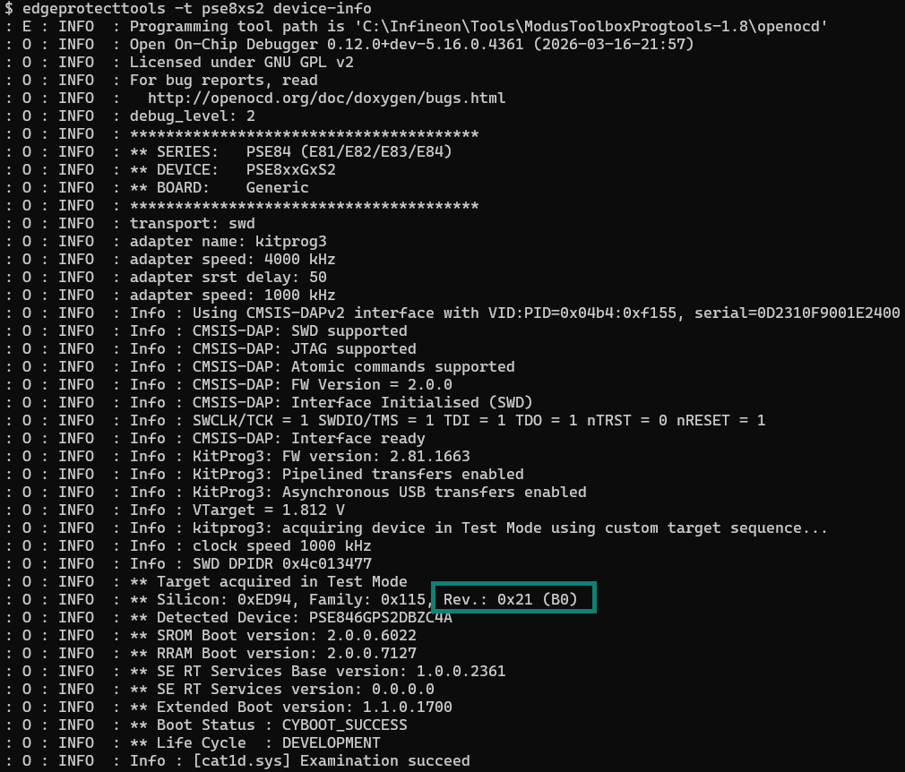
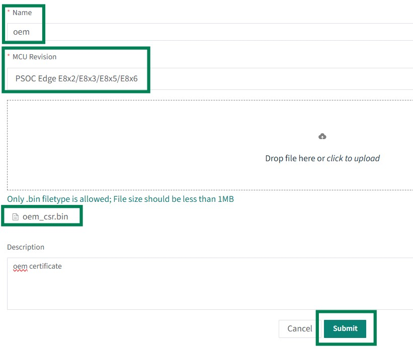
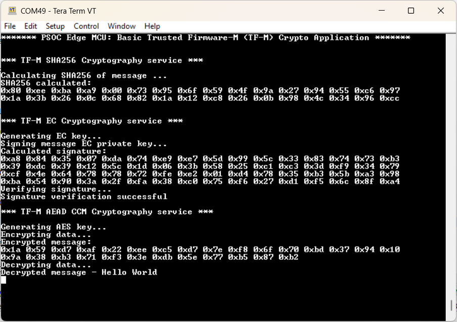

# PSOC&trade; Edge MCU: Trusted Firmware-M (TF-M) Crypto application - EPC2

This code example demonstrates cryptography using Trusted Firmware-M (TF-M) on PSOC&trade; Edge MCU. The example demonstrates how to initialize the TF-M NS interface in CM33 NS and CM55 NS projects, and use the cryptographic services offered by TF-M with PSA APIs. The code example is designed to work on Edge Protect Category 2 (EPC2) MCU. For more information about Edge Protect category, see [Infineon Edge Protect](https://www.infineon.com/promo/edge-protect).

This code example has a three project structure - CM33 secure, CM33 non-secure, and CM55 project.

**proj_cm33_s**: TF-M is available as source code in the mtb_shared directory. The proj_cm33_s is built entirely using this TF-M library. The project directory contains only the Makefile and dependency files required to integrate and build the TF-M library. The TF-M application is executed from external flash.

**proj_cm33_ns**: This is the M33 NSPE project which contains the TF-M interface and calls the PSA APIs to use TF-M services. The CM33 NS application is executed from external flash and does not use RTOS.

**proj_cm55**: This is the M55 NSPE project. This project also has TF-M interface but does not call PSA APIs. Include the required PSA interface header files, and the project is ready to use the PSA APIs. The CM55 project is executed from external flash and does not use RTOS.

[View this README on GitHub.](https://github.com/Infineon/mtb-example-psoc-edge-epc2-tfm-crypto)

[Provide feedback on this code example.](https://yourvoice.infineon.com/jfe/form/SV_1NTns53sK2yiljn?Q_EED=eyJVbmlxdWUgRG9jIElkIjoiQ0UyNDE1MDkiLCJTcGVjIE51bWJlciI6IjAwMi00MTUwOSIsIkRvYyBUaXRsZSI6IlBTT0MmdHJhZGU7IEVkZ2UgTUNVOiBUcnVzdGVkIEZpcm13YXJlLU0gKFRGLU0pIENyeXB0byBhcHBsaWNhdGlvbiAtIEVQQzIiLCJyaWQiOiJ0ZWphcy5rYWRnYW9ua2FyQGluZmluZW9uLmNvbSIsIkRvYyB2ZXJzaW9uIjoiMi4zLjAiLCJEb2MgTGFuZ3VhZ2UiOiJFbmdsaXNoIiwiRG9jIERpdmlzaW9uIjoiTUNEIiwiRG9jIEJVIjoiSUNXIiwiRG9jIEZhbWlseSI6IlBTT0MifQ==)

See the [Design and implementation](docs/design_and_implementation.md) for the functional description of this code example.


## Requirements

- [ModusToolbox&trade;](https://www.infineon.com/modustoolbox) v3.8 or later (tested with v3.8)
- Board support package (BSP) minimum required version for:
   - KIT_PSE84_EVAL_EPC2: v1.3.0 or later
   - KIT_PSE84_AI: v1.3.0 or later
- Programming language: C
- Other tools: Python v3.10 or later
- Associated parts: All [PSOC&trade; Edge EPC2 MCU](https://www.infineon.com/products/microcontroller/32-bit-psoc-arm-cortex/32-bit-psoc-edge-arm) parts


## Supported toolchains (make variable 'TOOLCHAIN')

- GNU Arm&reg; Embedded Compiler v14.2.1 (`GCC_ARM`) – Default value of `TOOLCHAIN`
- Arm&reg; Compiler v6.22 (`ARM`)
- IAR C/C++ Compiler v9.50.2 (`IAR`)


## Supported kits (make variable 'TARGET')

- [PSOC&trade; Edge E84 Evaluation Kit](https://www.infineon.com/KIT_PSE84_EVAL) (`KIT_PSE84_EVAL_EPC2`) – Default value of `TARGET`
- [PSOC&trade; Edge E84 AI Kit](https://www.infineon.com/KIT_PSE84_AI) (`KIT_PSE84_AI`)


## Hardware setup

This example does not use the board's default configuration.

Ensure the following jumper and pin configuration on board.
- BOOT SW must be in the LOW/OFF position
- J20 and J21 must be in the tristate/not connected (NC) position

For the `KIT_PSE84_AI` kit, either remove the R188 resistor and populate the R187 resistor to pull the boot pin to LOW, or follow the steps mentioned in the [Ownership transfer ](#ownership-transfer) section to avoid hardware rework.


## Software setup

See the [ModusToolbox&trade; tools package installation guide](https://www.infineon.com/ModusToolboxInstallguide) for information about installing and configuring the tools package.

Install a terminal emulator if you do not have one. Instructions in this document use [Tera Term](https://teratermproject.github.io/index-en.html).

Install the Python interpreter and add it to the top of the system path in environmental variables. This code example is tested with [Python v3.10](https://www.python.org/downloads/release/python-31020/).

> **Note:** This code example currently does not work with the custom BSP name for the `KIT_PSE84_AI` kit. If you want to change the BSP name to a non-default value, ensure to update the custom BSP name in proj_cm33_s *Makefile* under the relevant section. The build fails if you do not update the custom BSP name.


## Operation

### Add the Edge Protect Bootloader

1. Add proj_bootloader to this code example as a first step. Follow **Step 2** to **Step 9** in the "Operation" section of the [Edge Protect Bootloader](https://github.com/Infineon/mtb-example-edge-protect-bootloader) code example's *README.md* file
  
> **Note:** [Edge Protect Bootloader](https://github.com/Infineon/mtb-example-edge-protect-bootloader) *README.md* describes how to add the bootloader to Basic Secure App. Add it to this code example instead.


#### Determine silicon revision before using Edge Protect Tools

> **Note**: Skip this section and Ownership transfer section if `KIT_PSE84_EVAL_EPC2` is used or if hardware rework is performed on KIT_PSE84_AI.

Prior to executing Edge Protect Tools commands, you must identify the silicon revision (B0 or B1) of your device. Edge Protect Tools v2.0.0 or later includes support for the B1 silicon revision. Commands that require the `--target` / `-t` option use the B1 silicon revision by default. For devices with the earlier B0 silicon revision, the silicon revision must be specified using the `--rev` options. Follow these steps to identify the silicon revision:

1. Execute the following command to identify the silicon revision:

   - For EPC2 devices (KIT_PSE84_EVAL_EPC2 and KIT_PSE84_AI):

    ```
    edgeprotecttools -t pse8xs2 device-info
    ```

   > **Note:** Use target '-t pse8xs4' for EPC4 device

   The output will display device information including the silicon revision. Identify the silicon revision field indicating either Rev. B0 or Rev. B1

   **Figure 1. Device information output showing silicon revision**

   

2. Use the correct command syntax based on silicon revision:

   While using the Edge Protect Tools commands that require the `--target` / `-t` option, `--rev B0` parameter must be appended for B0 silicon

**Table 1. Action required based on silicon revision**

   | Silicon revision | Action required |
   |------------------|-----------------|
   | B0 | Append `--rev B0` parameter (case-insensitive) to Edge Protect Tools commands that require the `--target/-t` option |
   | B1 | No additional argument is required |

   <br>

   **Table 2. Command usage based on silicon revision**

   | Silicon revision | Command |
   |------------------|---------|
   | B0 | `edgeprotecttools -t pse8xs2 --rev B0 init` |
   | B1 | `edgeprotecttools -t pse8xs2 init` |


#### Ownership transfer

Transfer the ownership of the device to yourself before changing the policy file. Follow the steps to transfer ownership. 

1. Open ModusToolbox&trade; shell and navigate to the working directory where you want to initialize Edge Protect Tools and create associated assets, such as keys and policies

    ```
    cd <app-directory>
    ```


2. Execute the following command to initialize the tools. This step is required only once when using a new application directory or a new version of the tools.

   - For EPC2 devices (KIT_PSE84_EVAL_EPC2 and KIT_PSE84_AI), use this command:

        ```
        edgeprotecttools -t pse8xs2 init
        ```

    - For EPC4 device (KIT_PSE84_EVAL_EPC4), use this command:
        ```
        edgeprotecttools -t pse8xs4 init
        ```
    > **Note:** When using any Edge Protect Tools command that requires the `--target` / `-t` option, `--rev B0` parameter must be appended for B0 silicon. For silicon revision B1, no additional argument is needed. See the "Determine silicon revision before using Edge Protect Tools" section in [AN237849 – Getting started with PSOC&trade; Edge security](https://www.infineon.com/AN237849) for more details on how to identify the silicon revision

3. Execute the following command to configure the openOCD tools path:

    ```
    edgeprotecttools set-ocd --name openocd --path <openocd_path>
    ```

    > **Note:** Replace <openocd_path> with the path to the openocd directory. Typically, this will be C:/Infineon/Tools/ModusToolboxProgtools-1.5/openocd

4. Create a private and public key pair. The following command generates one pair of keys that is placed in the keys directory:

    ```
    edgeprotecttools create-key --key-type ECDSA-P256 --output keys/oem_private_key_0.pem keys/oem_public_key_0.pem
    ```

5. To generate a new CSR, execute this command:

    ```
    edgeprotecttools -t pse8xs2 oem-csr --certificate-name "oem-cert" --oem "Dummy OEM" --project "Dummy Project" --project-number "1234" --public-key-0 keys/oem_public_key_0.pem --cert-type development --output packets/apps/prov_oem/oem_csr.bin --sign-key-0 keys/oem_private_key_0.pem
    ```

6. Submit the generated CSR to [Edge Protect Signing Service](https://osts.infineon.com/) to generate the Infineon-signed OEM certificate and download the generated certificate

   **Figure 2. Submit CSR to generate signed certificate**

   

7. Provision the device with the new key and certificate to transfer the ownership

    ```
    edgeprotecttools -t pse8xs2 provision-device -p policy/policy_oem_provisioning.json --key keys/oem_private_key_0.pem --ifx-oem-cert packets/apps/prov_oem/oem_cert.bin
    ```

    > **Note:** See [AN237849](https://www.infineon.com/AN237849) for more details on transfer of ownership

8. Customize the generated OEM policy JSON file to ignore the boot pin status while booting

   While performing the provisioning steps, once the OEM key pair has been generated, set the 'oem_alt_boot' to "false" in the *policy/policy_oem_provisioning.json* file in the project before provisioning the kit

   For detailed instructions to provision the kit, see the "Development flow" section in the [AN237849 – Getting started with PSOC&trade; Edge security](https://www.infineon.com/AN237849)

   > **Note:** To evaluate other code examples that boot from QSPI flash, reprovision the kit with the default settings. Before reprovisioning, set 'oem_alt_boot' to "true" in the *policy/policy_oem_provisioning.json* file of the project

9. Once the policy is updated, provision the device with the updated policy

    ```
    edgeprotecttools -t pse8xs2 provision-device -p policy/policy_oem_provisioning.json --key keys/oem_private_key_0.pem
    ```

    For provisioning details, see "Provisioning and the policy file" section of [AN237849](https://www.infineon.com/AN237849)


### Program the application

See [Using the code example](docs/using_the_code_example.md) for instructions on creating a project, opening it in various supported IDEs, and performing tasks such as building, programming, and debugging the application within the respective IDEs.

> **Note**: Windows has a maximum path length limit of 260 characters. To ensure that the TF-M application to builds successfully, the <WorkspacePath>\<Application Name> path (including the back slash) must be 32 characters or fewer.

1. Connect the board to your PC using the provided USB cable through the KitProg3 USB connector

2. Open a terminal program and select the KitProg3 COM port. Set the serial port parameters to 8N1 and 115200 baud

3. Program the board with the TF-M application. After programming, the application starts automatically. Confirm that "PSOC Edge MCU: Basic Trusted Firmware-M (TF-M) Crypto Application" is displayed on the UART terminal

   **Figure 3. Terminal output on program startup**

   


## Related resources

Resources  | Links
-----------|----------------------------------
Application notes  | [AN235935](https://www.infineon.com/AN235935) – Getting started with PSOC&trade; Edge E8 MCU on ModusToolbox&trade; software
Application notes | [AN240096](https://www.infineon.com/AN240096)- Getting started with Trusted Firmware-M (TF-M) on PSOC&trade; Edge
Code examples  | [Using ModusToolbox&trade;](https://github.com/Infineon/Code-Examples-for-ModusToolbox-Software) on GitHub
Device documentation | [PSOC&trade; Edge MCU datasheets](https://www.infineon.com/products/microcontroller/32-bit-psoc-arm-cortex/32-bit-psoc-edge-arm#documents) <br> [PSOC&trade; Edge MCU reference manuals](https://www.infineon.com/products/microcontroller/32-bit-psoc-arm-cortex/32-bit-psoc-edge-arm#documents)
Development kits | Select your kits from the [Evaluation board finder](https://www.infineon.com/cms/en/design-support/finder-selection-tools/product-finder/evaluation-board)
Libraries  | [mtb-dsl-pse8xxgp](https://github.com/Infineon/mtb-dsl-pse8xxgp) – Device support library for PSE8XXGP <br> [retarget-io](https://github.com/Infineon/retarget-io) – Utility library to retarget STDIO messages to a UART port
Tools  | [ModusToolbox&trade;](https://www.infineon.com/modustoolbox) – ModusToolbox&trade; software is a collection of easy-to-use libraries and tools enabling rapid development with Infineon MCUs for applications ranging from wireless and cloud-connected systems, edge AI/ML, embedded sense and control, to wired USB connectivity using PSOC&trade; Industrial/IoT MCUs, AIROC&trade; Wi-Fi and Bluetooth&reg; connectivity devices, XMC&trade; Industrial MCUs, and EZ-USB&trade;/EZ-PD&trade; wired connectivity controllers. ModusToolbox&trade; incorporates a comprehensive set of BSPs, HAL, libraries, configuration tools, and provides support for industry-standard IDEs to fast-track your embedded application development

<br>


## Other resources

Infineon provides a wealth of data at [www.infineon.com](https://www.infineon.com) to help you select the right device, and quickly and effectively integrate it into your design.


## Document history

Document title: *CE241509* - *PSOC&trade; Edge MCU: Trusted Firmware-M (TF-M) Crypto application - EPC2*

 Version | Description of change
 ------- | ---------------------
 1.x.0   | New code example <br> Early access release
 2.0.0   | GitHub release
 2.1.0   | Update PPC configuration
 2.2.0   | Added MTB_SUPPORTED_TOOLCHAINS variable for automated build systems <br> Updated design files to fix ModusToolbox&trade; v3.7 build warnings
 2.3.0   | Added KIT_PSE84_AI support <br> Added Python installation prerequisite note
<br>


All referenced product or service names and trademarks are the property of their respective owners.

The Bluetooth&reg; word mark and logos are registered trademarks owned by Bluetooth SIG, Inc., and any use of such marks by Infineon is under license.

PSOC&trade;, formerly known as PSoC&trade;, is a trademark of Infineon Technologies. Any references to PSoC&trade; in this document or others shall be deemed to refer to PSOC&trade;.


---------------------------------------------------------

(c) 2026, Infineon Technologies AG, or an affiliate of Infineon Technologies AG. All rights reserved.

This software, associated documentation and materials ("Software") is owned by Infineon Technologies AG or one of its affiliates ("Infineon") and is protected by and subject to worldwide patent protection, worldwide copyright laws, and international treaty provisions. Therefore, you may use this Software only as provided in the license agreement accompanying the software package from which you obtained this Software. If no license agreement applies, then any use, reproduction, modification, translation, or compilation of this Software is prohibited without the express written permission of Infineon.
<br>
Disclaimer: UNLESS OTHERWISE EXPRESSLY AGREED WITH INFINEON, THIS SOFTWARE IS PROVIDED AS-IS, WITH NO WARRANTY OF ANY KIND, EXPRESS OR IMPLIED, INCLUDING, BUT NOT LIMITED TO, ALL WARRANTIES OF NON-INFRINGEMENT OF THIRD-PARTY RIGHTS AND IMPLIED WARRANTIES SUCH AS WARRANTIES OF FITNESS FOR A SPECIFIC USE/PURPOSE OR MERCHANTABILITY. Infineon reserves the right to make changes to the Software without notice. You are responsible for properly designing, programming, and testing the functionality and safety of your intended application of the Software, as well as complying with any legal requirements related to its use. Infineon does not guarantee that the Software will be free from intrusion, data theft or loss, or other breaches (“Security Breaches”), and Infineon shall have no liability arising out of any Security Breaches. Unless otherwise explicitly approved by Infineon, the Software may not be used in any application where a failure of the Product or any consequences of the use thereof can reasonably be expected to result in personal injury.
